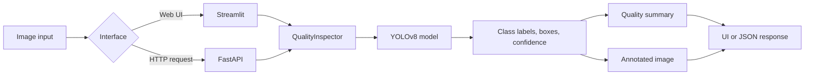
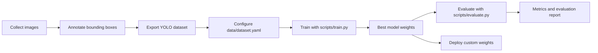
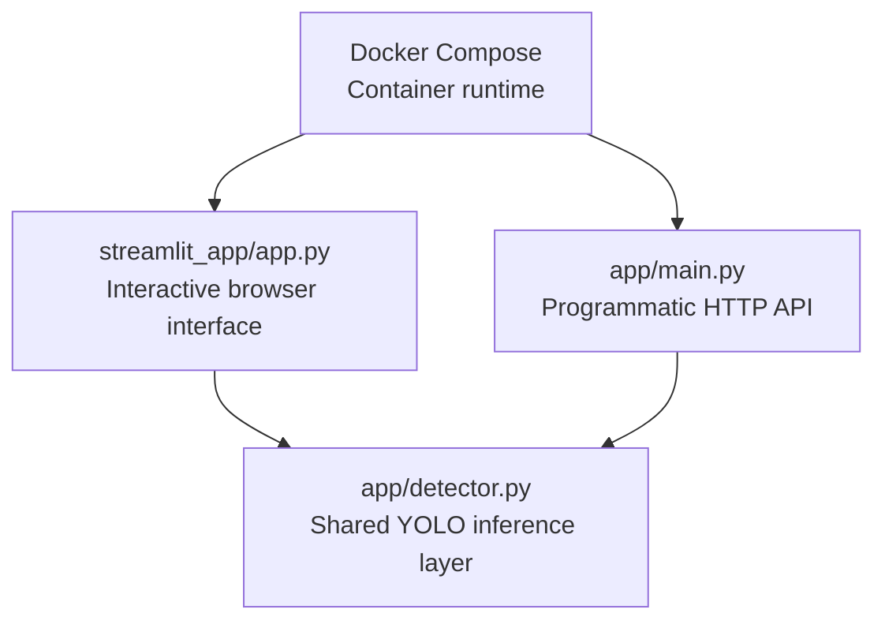

# Computer Vision Quality Inspection System

An end-to-end computer vision application for image-based object detection and visual inspection. The system provides a Streamlit interface, a FastAPI inference service, YOLOv8 model integration, evaluation utilities, automated tests, containerization, and continuous integration.

**Live demo:** [https://computer-vision-quality-inspection.streamlit.app/](https://computer-vision-quality-inspection.streamlit.app/)

**Video walkthrough:** [https://youtu.be/Q--L_X0D3fg](https://youtu.be/Q--L_X0D3fg)

## Overview

Visual inspection is widely used in manufacturing, agriculture, infrastructure monitoring, recycling, and logistics. Manual inspection is difficult to scale, introduces operator variability, and may fail to identify subtle or infrequent defects.

This project demonstrates a deployable inspection pipeline in which a user submits an image and receives:

- detected object classes;
- bounding boxes;
- per-detection confidence scores;
- an annotated output image;
- a summary grade derived from detection confidence.

The included baseline uses pretrained YOLOv8 weights and therefore detects classes from the COCO dataset. It is suitable for demonstrating the application architecture and inference workflow. Domain-specific defect detection-such as cracks, corrosion, damaged fruit, or manufacturing faults-requires training the model on an annotated domain dataset.

## Problem and Solution

### Problem

Manual visual inspection has several limitations:

- inspection throughput is constrained by available personnel;
- decisions may vary between operators;
- repetitive inspection can result in fatigue-related errors;
- inspection records are difficult to standardize;
- scaling the process increases operational cost.

### Proposed solution

The application applies a YOLOv8 object-detection model to uploaded images. A common inference layer is exposed through:

1. a Streamlit user interface for interactive inspection; and
2. a FastAPI service for programmatic integration.

The architecture also includes scripts for model training and validation so that the pretrained baseline can be replaced with a custom inspection model.

## System Workflow



### Training and evaluation workflow



## Technology Stack

- **Python 3.12**
- **Ultralytics YOLOv8** and **PyTorch** for object detection
- **OpenCV** and **NumPy** for image processing
- **FastAPI** for the inference API
- **Streamlit** for the interactive user interface
- **pytest** for automated testing
- **Docker** and **Docker Compose** for containerized execution
- **GitHub Actions** for continuous integration

## Project Structure

```text
computer-vision-quality-inspection/
├── .github/
│   └── workflows/
│       └── ci.yml                 # CI workflow: dependency installation and tests
├── app/
│   ├── __init__.py                # Package metadata
│   ├── config.py                  # Paths, thresholds, model, and target-class settings
│   ├── detector.py                # YOLO loading, inference, parsing, grading, and annotation
│   └── main.py                    # FastAPI application and HTTP endpoints
├── data/
│   ├── dataset.yaml               # YOLO dataset configuration template
│   └── sample_images/             # Street and people demonstration images
├── models/
│   └── .gitkeep                   # Local model-weight directory
├── outputs/
│   └── .gitkeep                   # Generated annotated images
├── reports/
│   └── evaluation_report.md       # Generated or baseline evaluation report
├── scripts/
│   ├── create_sample_image.py     # Synthetic image utility
│   ├── download_model.py          # Pretrained YOLO weight downloader
│   ├── download_samples.py        # Sample-image downloader
│   ├── evaluate.py                # Model validation and report generation
│   └── train.py                   # Custom YOLO training entry point
├── streamlit_app/
│   └── app.py                     # Upload interface, samples, results, and explanations
├── tests/
│   ├── test_api.py                # FastAPI endpoint tests with a mock detector
│   └── test_quality_grading.py    # Quality-summary unit tests
├── Dockerfile                     # Application container image
├── docker-compose.yml             # API and UI services
├── Makefile                       # Common development commands
├── pytest.ini                     # pytest configuration
├── packages.txt                   # System libraries for Linux/cloud hosts
├── runtime.txt                    # Python version requested by Streamlit Cloud
└── requirements.txt               # Python dependencies
```

## Result Interpretation

The application reports the following values:

- **Class name:** object category predicted by YOLOv8.
- **Bounding box:** pixel coordinates of the detected region.
- **Confidence:** model confidence for an individual detection, represented from 0 to 1.
- **Objects found:** number of retained detections.
- **Quality score:** average detection confidence multiplied by 100.
- **Quality grade:** a categorical summary of the average confidence:
  - `Good`: at least 70%;
  - `Fair`: 45% to less than 70%;
  - `Poor`: below 45%;
  - `Needs Review`: no target objects detected.

The quality score is an application-level confidence summary, not a validated measure of physical product quality. A production defect-grading system must use domain-specific classes, labels, thresholds, and validation data.

## How the Components Relate

Streamlit, FastAPI, and Docker are not three independent implementations. They are different access and execution layers around the same inference code:



- **Streamlit** is the primary interface for manually uploading images and reviewing predictions.
- **FastAPI** exposes the same detector to scripts, mobile applications, or other services.
- **Docker Compose** is an alternative execution method that starts both interfaces in containers. It is not required when running the Python applications directly.

For normal local evaluation, complete the common setup once and run Streamlit. Start FastAPI only when the HTTP API is needed. Use Docker instead of the local Python commands when testing the containerized deployment.

## Common Local Setup

### Prerequisites

- Python 3.12
- Git
- Docker Desktop, if containerized execution is required

Python 3.13 is not recommended for this project because the Intel macOS PyTorch build used here requires Python 3.12 and NumPy 1.x.

### 1. Clone and enter the repository

```bash
git clone https://github.com/ksganni/computer-vision.git
cd computer-vision
```

If the repository already exists locally:

```bash
cd ~/Projects/computer-vision-quality-inspection
```

### 2. Create a virtual environment

```bash
python3.12 -m venv .venv
source .venv/bin/activate
python --version
```

The reported interpreter version should be Python 3.12.

### 3. Install dependencies

```bash
python -m pip install --upgrade pip
pip install -r requirements.txt
pip install -r requirements-dev.txt
```

On Intel macOS, use `requirements-macos.txt` instead of `requirements.txt`.

### 4. Download model weights

```bash
python scripts/download_model.py
```

The expected model location is `models/yolov8n.pt`. If the utility encounters a platform-specific runtime error, the weights can be downloaded directly:

```bash
curl -L -o models/yolov8n.pt \
  https://github.com/ultralytics/assets/releases/download/v8.3.0/yolov8n.pt
```

### 5. Run automated tests

```bash
pytest
```

The test suite validates the API contract and quality-summary logic without requiring model inference.

## Running the Application

After completing the common setup, select one of the following execution paths.

### Option A - Interactive application (recommended)

Use this option to upload images and review annotated predictions in a browser. FastAPI and Docker are not required.

```bash
source .venv/bin/activate
streamlit run streamlit_app/app.py --server.port 8502
```

Open `http://localhost:8502`.

The sidebar provides two demonstration images:

- **Street scene:** bus, person, and vehicle detection;
- **People:** person detection.

Uploading a new image replaces the previous image and result. Enable **Detect all objects** for general COCO detection; disable it to retain only configured food-related classes.

### Option B - Inference API

Use this option when another program must send images to the detector. The API and Streamlit interface share `app/detector.py`, but they run as separate processes. Streamlit currently invokes the detector directly and does not depend on FastAPI.

```bash
source .venv/bin/activate
uvicorn app.main:app --reload --port 8001
```

Available endpoints:

- `GET /` - service metadata;
- `GET /health` - health and version response;
- `POST /predict` - multipart image inference;
- `GET /outputs/{filename}` - annotated-image retrieval;
- `GET /docs` - interactive OpenAPI documentation.

Example request:

```bash
curl -X POST \
  -F "file=@path/to/image.jpg" \
  http://127.0.0.1:8001/predict
```

### Option C - Containerized application

Docker Compose is an alternative to Options A and B. It builds the project environment and starts both the Streamlit interface and FastAPI service.

Build and start the API and UI services:

```bash
docker compose up --build
```

Default service URLs:

- FastAPI: `http://localhost:8000/docs`
- Streamlit: `http://localhost:8501`

Stop the services:

```bash
docker compose down
```

Do not start the local Python services and Docker services on the same ports simultaneously.

## Streamlit Community Cloud Deployment

The interactive UI is intended for public demonstration on [Streamlit Community Cloud](https://share.streamlit.io) (free tier available). The app may sleep when idle, and the first request can take longer while dependencies and the YOLO model load.

### Deploy from GitHub

1. Push this repository to GitHub (public or private).
2. Open [https://share.streamlit.io](https://share.streamlit.io) and sign in with GitHub.
3. Click **Create app** / **New app**.
4. Select:
   - **Repository:** your `computer-vision-quality-inspection` repo
   - **Branch:** `main` (or your deployment branch)
   - **Main file path:** `streamlit_app/app.py`
5. Click **Deploy**.
6. Wait for the build to finish. The first start downloads `yolov8n.pt` automatically.
7. Open the app URL (typically `https://<app-name>.streamlit.app`).
8. Paste that URL into the **Live demo** line at the top of this README.

`requirements.txt` is installed automatically (Streamlit UI + YOLO stack).
`runtime.txt` requests Python 3.12, though Streamlit Community Cloud may ignore
it and provision a newer interpreter; the pinned dependency ranges resolve on
both.
`packages.txt` installs `libgl1` and `libglib2.0-0t64`, system libraries
required by the full `opencv-python` wheel that `ultralytics` declares as a
dependency. Without them, `import cv2` fails at application start with an
`ImportError`. The glib package must be named `libglib2.0-0t64`: the build
image runs Debian trixie, where the plain `libglib2.0-0` name resolves to an
older Debian bullseye build whose dependencies cannot be satisfied.

For local API and tests:

```bash
pip install -r requirements.txt
pip install -r requirements-dev.txt
```

For local Intel macOS development:

```bash
pip install -r requirements-macos.txt
pip install -r requirements-dev.txt
```

### What the public link shows

The Streamlit Cloud URL opens the inspection UI (image upload, reference images, detections, quality grade and score). FastAPI remains available for local and Docker use; it is not deployed by Streamlit Community Cloud.

## Custom Model Training

### Dataset preparation

1. Collect representative images from the target inspection environment.
2. Annotate each defect or object with bounding boxes.
3. Divide the data into training, validation, and optional test sets.
4. Export the annotations in YOLO format.
5. Place the dataset under `data/dataset/`.
6. Update `data/dataset.yaml` with the dataset paths and class names.

Expected layout:

```text
data/dataset/
├── images/
│   ├── train/
│   └── val/
└── labels/
    ├── train/
    └── val/
```

### Training

```bash
python scripts/train.py \
  --data data/dataset.yaml \
  --epochs 20 \
  --imgsz 640 \
  --batch 8
```

Training artifacts are written under `runs/detect/quality_inspection/`. The best checkpoint is normally:

```text
runs/detect/quality_inspection/weights/best.pt
```

### Evaluation

```bash
python scripts/evaluate.py \
  --model runs/detect/quality_inspection/weights/best.pt \
  --data data/dataset.yaml
```

The report records precision, recall, mAP@0.50, and mAP@0.50-0.95 when a valid dataset and model are available.

## Testing and Continuous Integration

Run tests locally:

```bash
pytest
```

The workflow in `.github/workflows/ci.yml` runs on pushes and pull requests for all branches. It:

1. checks out the repository;
2. configures Python 3.11;
3. installs dependencies;
4. executes pytest;
5. generates the evaluation report in demonstration mode.
